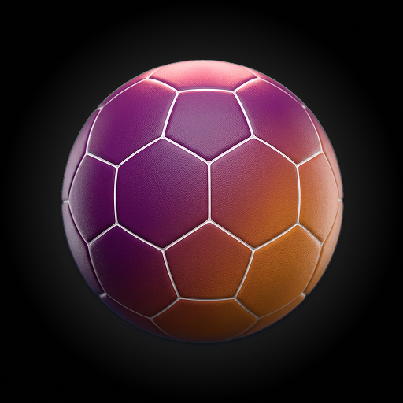
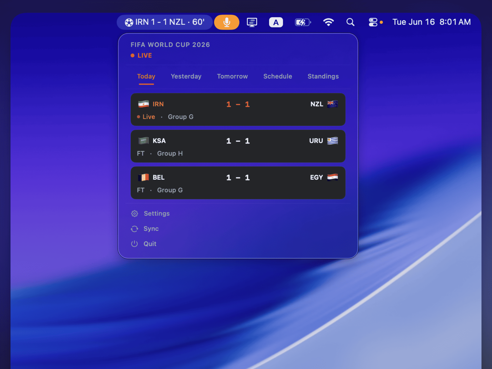
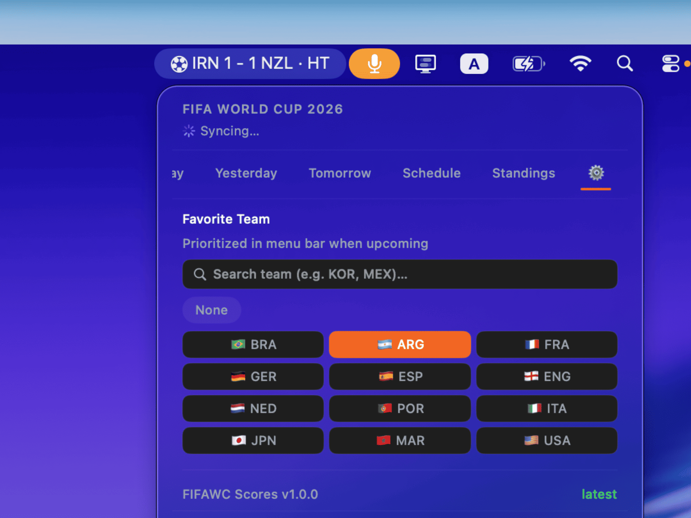

<div align="center">
  
  <h1>⚽ FIFAWC Scores</h1>
  <p><strong>Native macOS menu bar app for FIFA World Cup 2026</strong></p>
  <p>Live scores, match schedules, goal animations, and auto-updates — right from your menu bar.</p>

  <p>
    <a href="https://github.com/shafiswapnil/fifawc-scores/releases/latest"></a>
    <a href="https://github.com/shafiswapnil/fifawc-scores/releases"></a>
    
    
    
    <a href="LICENSE"></a>
  </p>
</div>

---

## Screenshot

<p align="center">
  
</p>

<p align="center">
  
  &nbsp;&nbsp;
  
</p>

<p align="center">
  
</p>

---

**FIFAWC Scores** is a lightweight, open-source **macOS menu bar agent** that shows
FIFA World Cup 2026 match schedules, live scores, and goal animations — all from
the menu bar. No Dock icon, no main window, no bloat. It fetches live data from
[football-data.org](https://www.football-data.org) and auto-updates via
[Sparkle](https://github.com/sparkle-project/Sparkle) when you install new
releases from GitHub.

## Install

**Download** — grab the latest `.zip` from
[Releases](https://github.com/shafiswapnil/fifawc-scores/releases/latest), unzip,
and drag **FIFAWC Scores.app** to your Applications folder.

> **First launch (unsigned build):** macOS may block the app because it's not
> notarized yet. Go to **System Settings → Privacy & Security** and click **Open
> Anyway**, then **Open** in the confirmation dialog. (Or run `xattr -dr
com.apple.quarantine "/Applications/FIFAWC Scores.app"` in Terminal.)

**Auto-updates:** once installed, the app checks for new releases automatically.
Click **Settings → Check for Updates…** to manually check. Sparkle handles
download, verification, and restart.

Requirements: **macOS 14 Sonoma or later** · Universal (Apple Silicon + Intel).

## Features

- **Dynamic menu bar label** — always visible without clicking: live score with minute counter, half-time, upcoming match, GOAL! alert
- **5 label states** — Idle, Upcoming (today only), Live (with elapsed minute), Half-time, Finished
- **GOAL! alert** — label text flips to `GOAL!` for 5 seconds on each goal, auto-reverts
- **Real-time minute counter** — ticks every 60s via an observable `minuteTick` property on MatchStore
- **Smart featured match** — shows most relevant match only; priority: live → today-upcoming → recent-finished; never shows future days
- **6 tabbed views** — Today, Yesterday, Tomorrow, Full Schedule, Standings, Settings
- **Live experience** — pulsing orange dot, team colors on match cards, clock-based status inference
- **Favorite team** — 12 popular teams + search for any nation, pinned to top of Today tab with orange glow highlight, Schedule tab filtered to your team
- **Schedule** — horizontal day pills (today ± 7 days), fetches ±7 days per selection
- **Dark glass panels** — dark aqua forced via AppKit bridge (`DarkModeBridge`), frosted card backgrounds
- **TRIONDA brand** — vibrant orange (#F26622) accent across live indicators, active tabs, favorite team highlights
- **Dynamic team colors** — card borders tinted with home team color, 48 nations covered
- **Live polling** — configurable interval (60–300s), smart idle/live state machine
- **Client-side status inference** — overrides stale API status using match clock logic
- **Auto-update** — Sparkle framework checks GitHub Releases for new versions
- **Lightweight** — <20 MB RAM, <1% CPU, native SwiftUI, no Electron
- **One dependency** — [Sparkle](https://github.com/sparkle-project/Sparkle) (~2MB), everything else is native
- **Settings shortcut** — ⚙️ Settings button always accessible in the footer

## Getting an API Key

1. Go to [football-data.org/client/register](https://www.football-data.org/client/register)
2. Create a free account
3. Copy your API key from the dashboard
4. Open FIFAWC Scores → ⚙️ Settings tab → paste your key

> The free tier allows 10 requests per minute — more than enough for this app.

## Website

Visit the landing page: [shafiswapnil.github.io/fifawc-scores](https://shafiswapnil.github.io/fifawc-scores/)

## Install (Build from Source)

```bash
# 1. Clone the repository
git clone https://github.com/shafiswapnil/fifawc-scores.git
cd fifawc-scores

# 2. Install XcodeGen (if not installed)
brew install xcodegen

# 3. Generate the Xcode project
xcodegen generate

# 4. Open in Xcode
open FIFAWCSCORES.xcodeproj
```

Then press **⌘R** to build and run. The app will appear in your menu bar.

### Build via command line

```bash
xcodegen generate
xcodebuild -project FIFAWCSCORES.xcodeproj -scheme FIFAWCSCORES \
  -configuration Debug -destination 'platform=macOS' \
  CODE_SIGNING_ALLOWED=NO build
```

## Usage

1. **Launch** — double-click FIFAWC Scores (or ⌘R in Xcode)
2. **Set API key** — click the ⚙️ tab, paste your key
3. **Pick your team** — select your favorite team in Settings to pin their matches
4. **Watch** — matches auto-poll, live scores update in the menu bar

### Menu Bar Display

| State     | Example                              | Notes                    |
| --------- | ------------------------------------ | ------------------------ |
| Idle      | `⚽ FWC`                              | No match data / no matches today |
| Upcoming  | `⚽ ESP vs CPV · 10:00 PM`           | Today's next match only  |
| Live      | `⚽ ESP 1-0 CPV · 67'`               | Ticks every 60s          |
| Half-time | `⚽ ESP 1-0 CPV · HT`               |                          |
| Finished  | `⚽ SWE 5-1 TUN · FT`               | Most recent result       |
| Goal      | `⚽ GOAL!`                            | 5 seconds, auto-dismisses |

### Panel Tabs

| Tab             | Description                                            |
| --------------- | ------------------------------------------------------ |
| **Today**       | Today's matches — favorite team pinned to top with orange highlight |
| **Yesterday**   | Yesterday's results                                    |
| **Tomorrow**    | Upcoming fixtures                                      |
| **Schedule**    | Horizontal day pills, ±7 days of matches per selection, filtered by favorite team |
| **Standings**   | Group tables (A–H)                                     |
| **⚙️ Settings** | API key, poll interval, favorite team picker, version status  |

## Architecture

```
Sources/
├── App/
│   ├── FIFAWCScoresApp.swift        # @main entry, Sparkle auto-updater
│   └── Theme.swift                  # TRIONDA color system + DarkModeBridge
├── Models/
│   ├── Match.swift                  # Match data model + Codable
│   ├── MatchStatus.swift            # Status enum (scheduled, live, finished…)
│   ├── Standing.swift               # Group standings model
│   ├── Team.swift                   # Team + flag emoji mapping (48 nations)
│   └── TeamColors.swift             # Team color theming (48 nations)
├── Services/
│   ├── FetchService.swift           # football-data.org API client (actor)
│   ├── MatchStore.swift             # Central @Observable state
│   └── PollController.swift         # Polling loop with smart intervals
├── Views/
│   ├── MenuBarLabel.swift           # Menu bar icon/text + goal animation
│   └── MenuBarPanel.swift           # Tabbed panel with match cards + settings
└── Resources/
    ├── Info.plist                   # LSUIElement, SUFeedURL (Sparkle)
    └── Assets.xcassets/             # App icon, accent color
Tests/
└── FIFAWCScoreTests/                # XCTest suite (54 tests)
    ├── MatchTests.swift
    ├── MatchStatusTests.swift
    ├── TeamTests.swift
    ├── StandingTests.swift
    ├── FetchServiceTests.swift
    └── MatchStoreTests.swift
scripts/
└── bump-version.sh                  # Version management (semver, commit, tag)
.github/workflows/
├── ci.yml                           # PR/push checks (parse + build + tests)
└── release.yml                      # Tag-triggered build → sign → release
docs/
└── index.html                       # GitHub Pages landing page
```

### Key Design Decisions

- **`@Observable`** for state management (no Combine)
- **`@MainActor`** isolation for MatchStore and PollController
- **`actor`** for FetchService (network state isolation)
- **Swift 6 strict concurrency** (`SWIFT_STRICT_CONCURRENCY=complete`)
- **XcodeGen** for project generation (`project.yml` → `.xcodeproj`)
- **Sparkle** for auto-updates (GitHub Releases as feed)
- **`DarkModeBridge`** — AppKit `NSViewRepresentable` that forces `NSAppearance.darkAqua` on the hosting window (`.preferredColorScheme(.dark)` doesn't work in `MenuBarExtra(.window)`)
- **`minuteTick: Date`** on MatchStore drives label re-renders every 60s via a `Task.sleep` loop — `TimelineView` is explicitly avoided as it hangs the app when used inside `MenuBarExtra` label context
- **`allMatches`** scoped to a 3-day window (yesterday/today/tomorrow) — prevents the Schedule tab's ±7d data from bleeding into `featuredMatch` logic
- **Favorite team** — pins matches to top of Today tab, adds orange glow highlight, filters Schedule tab

## Settings

| Setting        | Default | Description                              |
| -------------- | ------- | ---------------------------------------- |
| API Key        | (empty) | Your football-data.org API key           |
| Poll Interval  | 60s     | How often to fetch live scores (60–300s) |
| Favorite Team  | None    | Pins matches to Today tab, highlights with orange glow, filters Schedule |
| Version Status | —       | Current version (Sparkle auto-updates)   |

## API

This app uses the [football-data.org](https://www.football-data.org/docs/v4/) API v4.

- **Competition code**: `WC` (FIFA World Cup)
- **Auth**: `X-Auth-Token` header
- **Rate limit**: 10 requests/min (free tier)
- **Data**: Match schedules, live scores, group standings

## Tech Stack

| Component   | Technology                             |
| ----------- | -------------------------------------- |
| UI          | SwiftUI (MenuBarExtra + .window style) |
| Networking  | URLSession                             |
| State       | @Observable + @MainActor               |
| Concurrency | Swift 6 strict concurrency             |
| Project     | XcodeGen                               |
| API         | football-data.org v4                   |
| Auto-update | Sparkle (GitHub Releases feed)         |
| CI/CD       | GitHub Actions (build, sign, notarize) |

## Releasing

Releases are automated via GitHub Actions. When a version tag is pushed:

1. CI validates the version matches `project.yml`
2. Builds the `.app` bundle
3. Optionally signs + notarizes (when secrets are configured)
4. Creates a GitHub Release with the `.zip` attached
5. Updates `appcast.xml` for Sparkle auto-updates

```bash
# To make a release:
./scripts/bump-version.sh 1.1.0
git push origin main --tags
```

## License

[MIT](LICENSE)

---

<div align="center">

**Built with ❤️ for the beautiful game**

</div>
